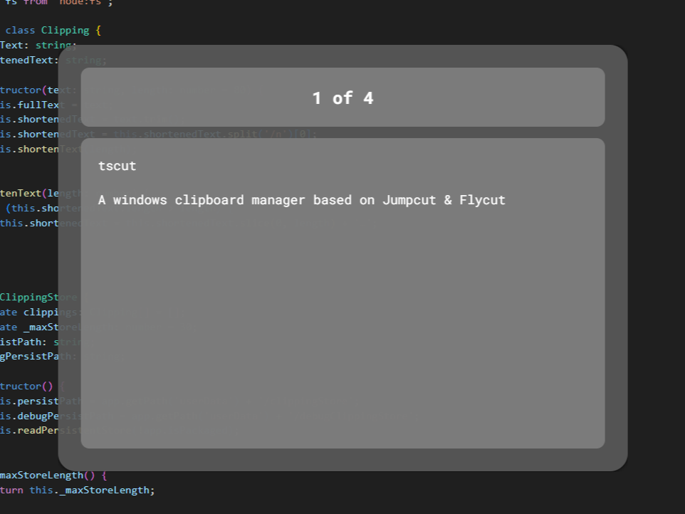

# tscut

A crossplatform clipboard manager based on Jumpcut & Flycut

## Usage

Press control-alt-v to open up the clipboard, use left & right or up & down to navigate through your clipboard history, then hit enter to paste the selected clipping or escape to close the window without pasting.

## Installing

### Windows
Download the tscut-setup.exe file from the latest release and run it.

It may need to be scanned by your anti-virus software and could show an error while this is happening, this error can be dismissed and won't affect the installation.

### Linux
Download the .deb file and run it

### MacOS
Download the .dmg file, open it and drag the app into the applications folder